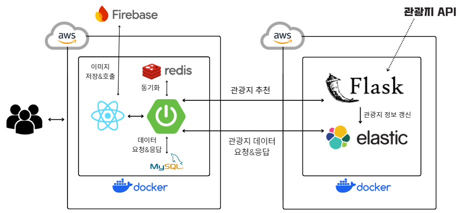

    

#  GotGam

<h3 style="border-bottom: none;">여행 정보 공유 및 추천 플랫폼</h3>

- 여행 일지를 작성하고 태그를 활용해 다른 사용자의 여행 기록을 쉽게 검색 기능

- AI 기반 추천 시스템을 통해 사용자 취향에 맞는 여행지 추천 제공 

- 관광지, 맛집, 숙소 정보를 한 곳에서 검색 가능

- 관광지에 댓글과 별점을 남겨 실제 방문자들의 생생한 평가 확인 가능

<h3 style="border-bottom: none;">🔗 URL</h3>

- [GotGam 홈페이지 바로가기](http://gotgam.store)

- [**Front** Git Code 바로가기](https://github.com/Got-Gam/GotGam_Front)

- [**Back** Git Code 바로가기](https://github.com/Got-Gam/GotGam_Back)

- [**Flask** Git Code 바로가기](https://github.com/Got-Gam/GotGam_Flask)

 

<!-- ## 목차

[사용 기술 및 개발 환경](#사용-기술-및-개발-환경)

  -->

## 🛠️ 사용 기술 및 개발 환경

><h3 style="border-bottom: none;">사용 기술</h3>

- <h3 style="border-bottom: none;">Frontend</h3>

&emsp;&emsp;

- <h3 style="border-bottom: none;">Backend</h3>

&emsp;&emsp;     

- <h3 style="border-bottom: none;">Database</h3>

&emsp;&emsp;   

- <h3 style="border-bottom: none;">ETC.</h3>

&emsp;&emsp;     

 

><h3 style="border-bottom: none;">개발 환경</h3>

 

## ✨ 주요 기능

><h3 style="border-bottom: none;">관광지</h3>

- 지역, 카테고리별 조회 및 키워드 검색 기능 제공

- 관광지 상세 정보 제공 및 카카오 지도를 통한 위치 확인

- 선택한 관광지를 기준으로 주변 관광지 10개 추천

- 관광지에 별점 및 댓글 작성 가능

- 관광지 북마크 기능으로 관심 장소 관리 가능

><h3 style="border-bottom: none;">여행일지</h3>

- 다녀온 여행을 자유롭게 기록할 수 있는 여행일지 기능

- 지역별 조회 및 키워드/태그 검색, 금액 범위 필터링 기능 제공

- 여행일지 북마크 기능으로 관심 여행일지 관리 가능

- 여행일지 공개/비공개 설정으로 개인 여행 기록 보안 관리

- 신고 기능을 통해 유해한 콘텐츠 제재 가능

><h3 style="border-bottom: none;">여행지 추천</h3>

- 간단한 사용자 정보 및 여행 선호도를 입력하면 맞춤형 여행지 추천

- 추천 결과를 클릭하여 검색 페이지 또는 상세 페이지로 즉시 이동 가능

- 사용자 취향에 맞춘 효율적인 여행지 탐색 경험 제공